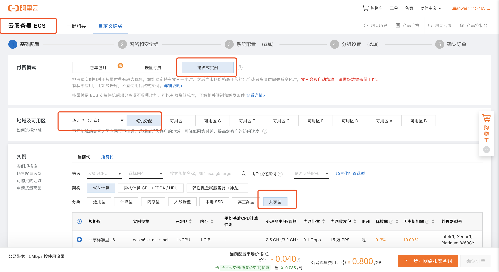
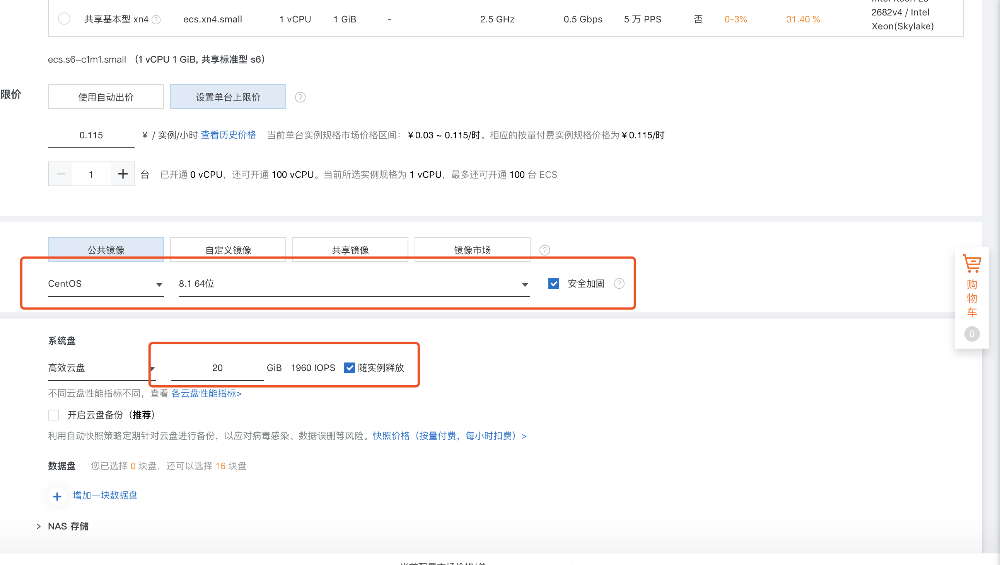
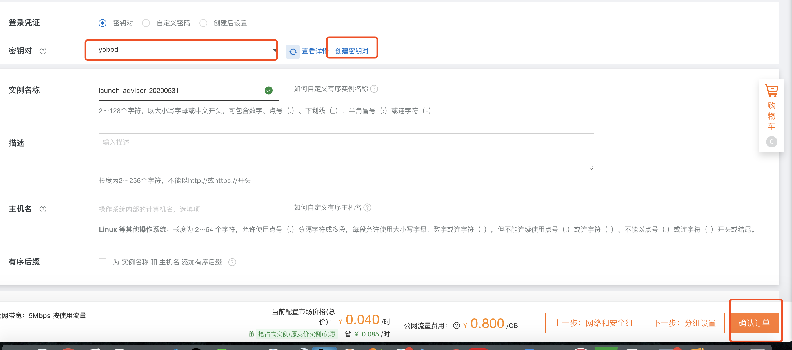
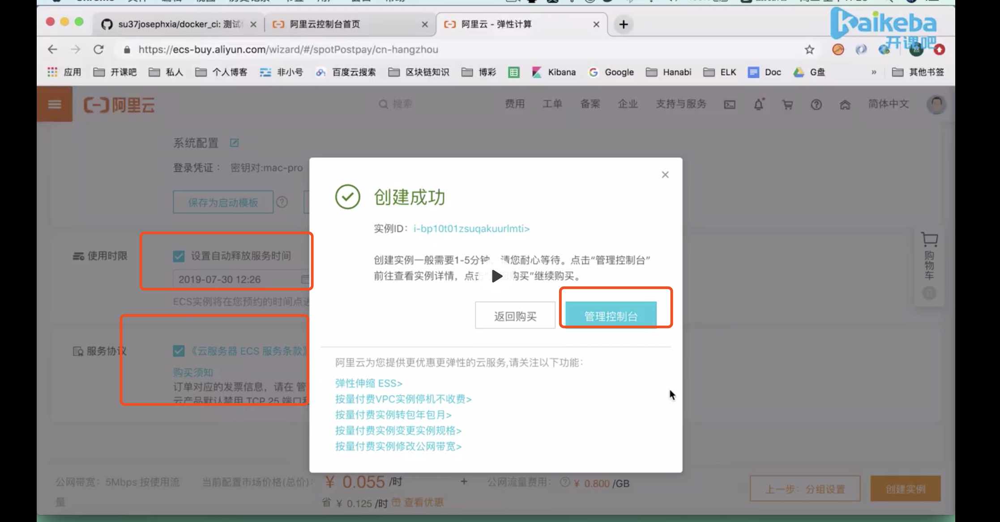
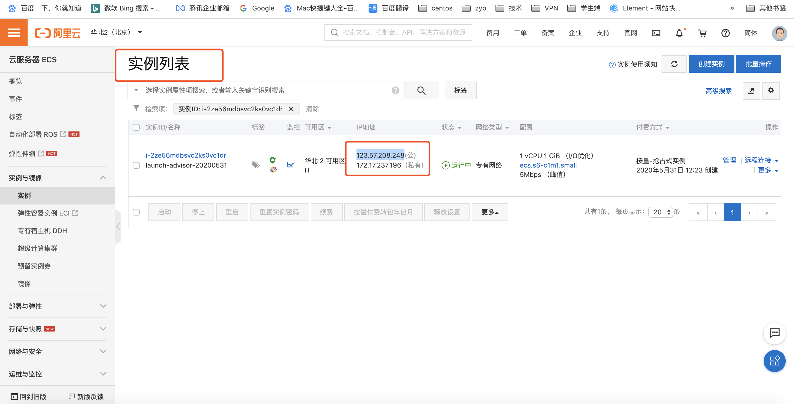
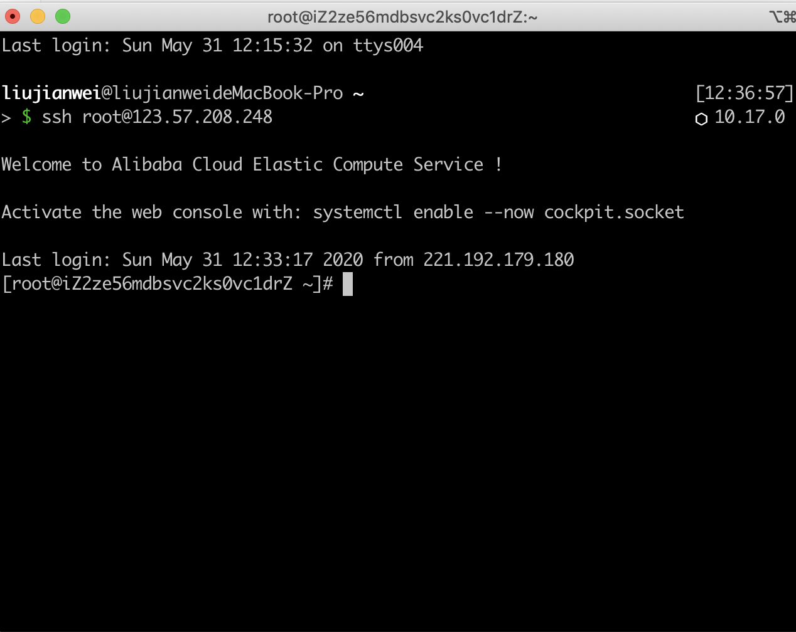

### [Vue-cli 3.0更换eslint方法](https://eslint.vuejs.org/user-guide/#installation)
- 替换eslint的方式

### [24个ES6方法，用来解决实际开发的JS问题！！](https://juejin.im/post/5ed08019e51d45786973c2e9?utm_source=gold_browser_extension)
- 1、如何隐藏所有指定的元素：通过Array.from把NodeList转换成NodeList 

- 如何获取当前页面的滚动位置？
```javascript
    const getScrollPosition = (el = window) => ({
  x: el.pageXOffset !== undefined ? el.pageXOffset : el.scrollLeft,
  y: el.pageYOffset !== undefined ? el.pageYOffset : el.scrollTop
});

// 事例
getScrollPosition(); // {x: 0, y: 200}

```

- 5.如何平滑滚动到页面顶部？
```javascript
   const scrollToTop = () => {
         const c = document.documentElement.scrollTop || document.body.scrollTop;
  if (c > 0) {
    window.requestAnimationFrame(scrollToTop);
    window.scrollTo(0, c - c / 8);
  }
}

// 事例
scrollToTop()
```
window.requestAnimationFrame()  告诉浏览器——你希望执行一个动画，并且要求浏览器在下次重绘之前调用指定的回调函数更新动画。该方法需要传入一个回调函数作为参数，该回调函数会在浏览器下一次重绘之前执行。
requestAnimationFrame：优势：由系统决定回调函数的执行时机。60Hz的刷新频率，那么每次刷新的间隔中会执行一次回调函数，不会引起丢帧，不会卡顿。

- 7.如何检查指定的元素在视口中是否可见 ？
```javascript
   const elementIsVisibleInViewport = (el, partiallyVisible = false) => {
  const { top, left, bottom, right } = el.getBoundingClientRect();
  const { innerHeight, innerWidth } = window;
  return partiallyVisible
    ? ((top > 0 && top < innerHeight) || (bottom > 0 && bottom < innerHeight)) &&
        ((left > 0 && left < innerWidth) || (right > 0 && right < innerWidth))
    : top >= 0 && left >= 0 && bottom <= innerHeight && right <= innerWidth;
};

// 事例
elementIsVisibleInViewport(el); // 需要左右可见
elementIsVisibleInViewport(el, true); // 需要全屏(上下左右)可以见
```
- 8.如何获取元素中的所有图像 ？
通过 数组的扩展运算符，把NodeList转换成数组
```javascript
    const getImages = (el, includeDuplicates = false) => {
  const images = [...el.getElementsByTagName('img')].map(img => img.getAttribute('src'));
  return includeDuplicates ? images : [...new Set(images)];
};

// 事例：includeDuplicates 为 true 表示需要排除重复元素
getImages(document, true); // ['image1.jpg', 'image2.png', 'image1.png', '...']
getImages(document, false); // ['image1.jpg', 'image2.png', '...']
```

- 11.如何创建一个包含当前URL参数的对象 ？
```javascript
    const getURLParameters = url =>
  (url.match(/([^?=&]+)(=([^&]*))/g) || []).reduce(
    (a, v) => ((a[v.slice(0, v.indexOf('='))] = v.slice(v.indexOf('=') + 1)), a),
    {}
  );

// 事例
getURLParameters('http://url.com/page?n=Adam&s=Smith'); // {n: 'Adam', s: 'Smith'}
getURLParameters('google.com'); // {}

```
- 自定义事件的函数有 Event、CustoEvent 和 dispatchEvent;
```javascript
    // 向 window 派发一个resize内置事件
    window.dispatchEvent(new Event('resize'))
 

// 直接自定义事件，使用 Event 构造函数：
var event = new Event('build');
var elem = document.querySelector('#id')
// 监听事件
elem.addEventListener('build', function (e) { ... }, false);
// 触发事件.
elem.dispatchEvent(event);
```
CustomEvent 可以创建一个更高度自定义事件,还可以附带一些数据,具体用法如下
```javascript
    var myEvent = new CustomEvent(eventname, options);
其中 options 可以是：
{
  detail: {
    ...
  },
  bubbles: true,    //是否冒泡
  cancelable: false //是否取消默认事件
}
```

```javascript
    // add an appropriate event listener
obj.addEventListener("cat", function(e) { process(e.detail) });
 
// create and dispatch the event
var event = new CustomEvent("cat", {"detail":{"hazcheeseburger":true}});
obj.dispatchEvent(event);
使用自定义事件需要注意兼容性问题，而使用 jQuery 就简单多了：

// 绑定自定义事件
$(element).on('myCustomEvent', function(){});
 
// 触发事件
$(element).trigger('myCustomEvent');
// 此外，你还可以在触发自定义事件时传递更多参数信息：
 
$( "p" ).on( "myCustomEvent", function( event, myName ) {
  $( this ).text( myName + ", hi there!" );
});
$( "button" ).click(function () {
  $( "p" ).trigger( "myCustomEvent", [ "John" ] );
});

```
- 23.如何确定页面的浏览器选项卡是否聚焦 
```javascript
const isBrowserTabFocused = () => !document.hidden;

// 事例
isBrowserTabFocused(); // true
```

### [前端内参](https://github.com/coffe1891/frontend-hard-mode-interview)
```javascript
/**
 * 深拷贝
 */
function deepCopy (obj) {
  let r = {}// Object.create(null)
  Object.keys(obj).forEach((key) => {
    const value = obj[key]
    if (value && typeof value === 'object') {
      r[key] = deepCopy(value)
    } else {
      r[key] = value
    }
  })
  // console.log(r);
  return r
}
```

### [阿里云的抢占式示例注册过程]
- 
- 
- 
- 
- 
- 
- 
- 
- 
- 
- 